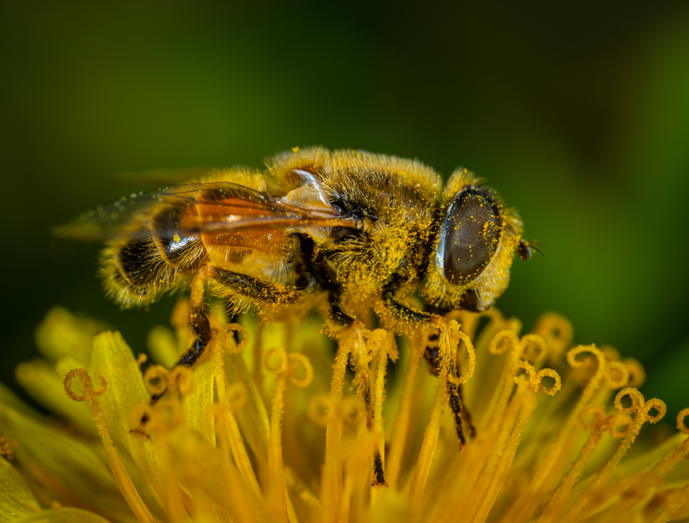

# Bee "karińska" race- the most common bee breed in Poland

demo
https://annasniegula.github.io/homepage/

  
## Bee quotes and proverbs 

## Information about breed
- provenance 
- profile
- "kraińska" breed lines

## Honey productivity of plants and their length of blooming table

Compare polish honey platns 

*toggle:*
- background of the webside
- header
- photo

Technologies on site:
- HTML
- CSS
- JAVA SCRIPT

